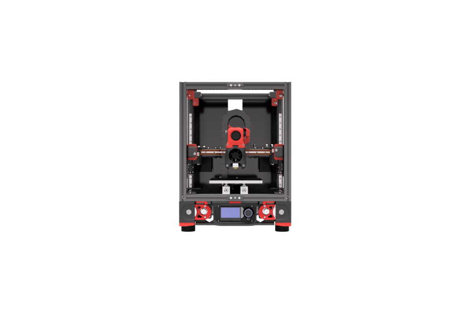

# Tiny-2
A [Voron2 2.4R2](https://vorondesign.com/voron2.4) scaled down to 150mm x 150mm x 130mm build volume and optional weight-saving XY gantry mods. **This is currently a work in process.**

<p align="center">
  
</p>

Original Source: https://github.com/VoronDesign/Voron-2

License: [License](./LICENSE.txt)

Changes: 

## Frame Specs

If ordering from Misumi, these are the specs - Standard 250mm build - 100mm

```
Misumi HFSB5-2020-330-LCP-RCP	4
Misumi HFSB5-2020-270-TPW	10
Misumi HFSB5-2020-250	2
Misumi HFSB5-2020-230	1
Misumi HFSB5-2020-140	1
```
DIN 3 Rails (35mm W) - 265mm - 1
DIN 3 Rails (35mm W) - 300mm - 2


## Panels

```
2 - 398mm x 284mm (side panels)
2 - 398mm x 142mm (front doors)
1 - 284mm x 284mm (top panel)

	Coroplast Sheet - 283x303x4 mm	1
Coroplast Sheet - 269x269x4 mm	2
Acrylic Sheet Clear - 283x303x3 mm	2
Acrylic Sheet Clear - 283x283x3 mm	1
Acrylic Sheet Clear - 141.5x303x3 mm	2
```

## Motion
- 6x Linear Rail MGN9H 200mm
- 1x Linear Rail MGN12H 200mm
- 4x GT2 Open Belt LL-2GT-9 (9mm wide) - 800mm
- 2x GT2 Open Belt LL-2GT-6 (6mm wide) - 1200mm


## Components
- 150mmx150mm bed - [Mandala Roseworks](https://www.mandalaroseworks.com/shop/tiny-t)
- 120mmx120mm 120w 24v heating pad - [Keenovo](https://keenovo.store/collections/standard-keenovo-silicone-heaters/products/keenovo-square-silicone-heater-3d-printer-build-plate-heatbed-heating-pad?variant=38120586870970)


## Images


### Mods used

